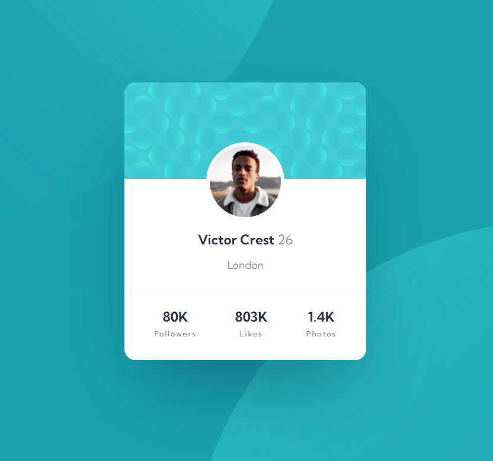

# Frontend Mentor - Profile card component solution

This is a solution to the [Profile card component challenge on Frontend Mentor](https://www.frontendmentor.io/challenges/profile-card-component-cfArpWshJ). Frontend Mentor challenges help you improve your coding skills by building realistic projects.

## Table of contents

- [Overview](#overview)
  - [Screenshot](#screenshot)
  - [Links](#links)
- [My process](#my-process)
  - [Built with](#built-with)
  - [Useful resources](#useful-resources)
- [Author](#author)

## Overview

### Screenshot

### Links

- Solution URL: [GitHub](https://github.com/Giorgi-Jalali/Profile-card-component)
- Live Site URL: [GitHub Pages](https://Giorgi-Jalali.github.io/Profile-card-component)

## My process

### Built with

- HTML5/CSS3
- Responsive Design

### Useful resources

- [MDN Web Docs](https://developer.mozilla.org/en-US/)
- [Css-Tricks](https://css-tricks.com/)
- [W3schools](https://www.w3schools.com/)

## Author

- Linkedin.com - [Giorgi Jalali](https://www.linkedin.com/in/giorgi-jalali-0336b8225/)
